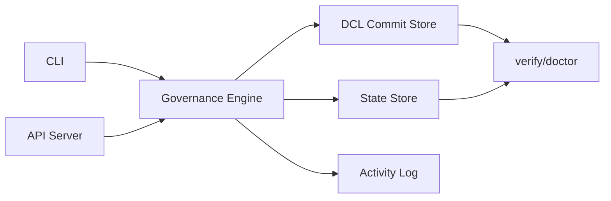
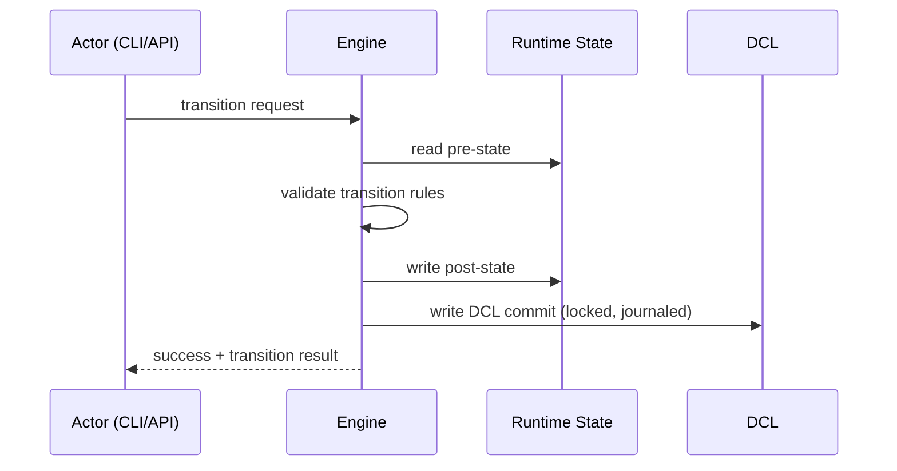
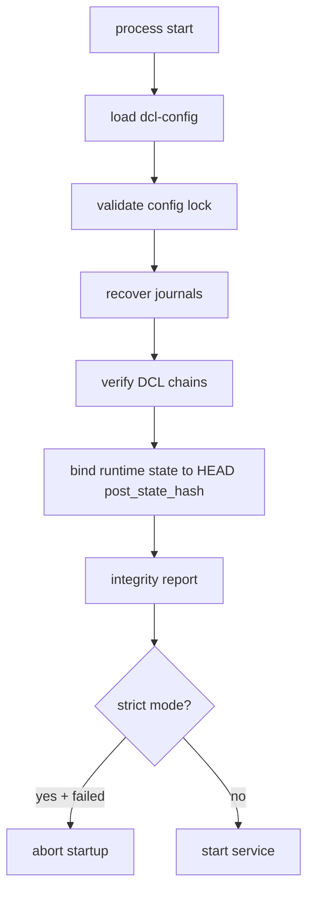

# Verification Architecture

## Runtime Architecture

## Packet Transition + Commit Flow

## Startup Verification Flow

## Data Model Summary

- Runtime state: `.governance/wbs-state.json`
- WBS definition: `.governance/wbs.json`
- DCL config lock: `.governance/dcl-config.json`
- DCL commits: `.governance/dcl/packets/<packet_id>/commits/*.json`
- DCL head pointer: `.governance/dcl/packets/<packet_id>/HEAD`
